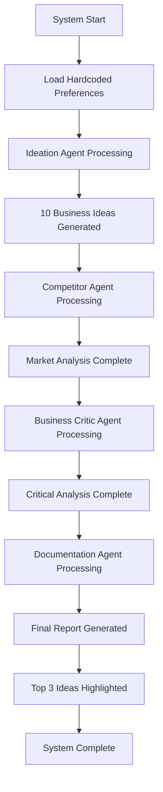
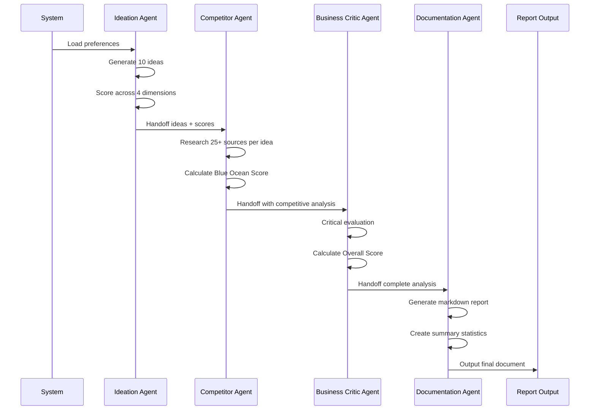

# Business Idea Generator POC - Functional Scope

## Project Overview

### Purpose
This POC demonstrates a multi-agent AI system that generates and evaluates business ideas based on user preferences. The system employs a sequential multi-agent pattern where each agent specializes in a specific aspect of business idea analysis.

### Value Proposition
- **Automated Ideation**: Generate creative business ideas that leverage current technology
- **Comprehensive Evaluation**: Multi-dimensional scoring across disruption, market potential, technical complexity, and capital requirements
- **Market Intelligence**: Competitive landscape analysis with extensive web research
- **Critical Analysis**: Balanced evaluation with realistic assessment of challenges
- **Structured Documentation**: Professional output format for decision-making

### High-Level Functionality
The system processes hardcoded business preferences through four specialized agents in sequence, ultimately producing a ranked list of business ideas with detailed analysis and recommendations.

## Functional Requirements

### FR1: Business Idea Generation
- Generate 10 detailed business ideas based on input preferences
- Each idea must include:
  - Descriptive title
  - Detailed operational description
  - Clear business model explanation
- Ideas should leverage current technology but represent novel applications

### FR2: Multi-Dimensional Scoring
- Score each business idea across four key dimensions (0-10 scale):
  - **Disruption Potential**: How revolutionary the idea is
  - **Market Potential**: Size and accessibility of target market
  - **Technical Complexity**: Development and implementation difficulty
  - **Capital Intensity**: Financial requirements to launch
- Provide detailed reasoning for each score

### FR3: Competitive Analysis
- Conduct extensive web research (minimum 25 sources per idea)
- Identify existing companies with similar products/services
- Generate "Blue Ocean Score" (0-10) indicating market whitespace
- Provide supporting evidence and reasoning

### FR4: Critical Evaluation
- Perform skeptical analysis of each business idea
- Research potential challenges and obstacles
- Generate "Overall Score" (0-10) with balanced assessment
- Provide evidence-based reasoning for final evaluation

### FR5: Professional Documentation
- Generate structured markdown report
- Include individual tables for each business idea
- Provide processing statistics and metadata
- Highlight top 3 recommendations in summary

## User Journey



### Input Stage
- **Preferences Structure**:
  - Vertical (e.g., "Media & Entertainment")
  - Sub-vertical (e.g., "Digital Media & Content Creation")
  - Business Model (e.g., "B2B SaaS")

### Processing Stage
- Sequential agent execution with handoffs
- Each agent builds upon previous agent's work
- Comprehensive research and analysis at each stage

### Output Stage
- Professional markdown documentation
- Statistical summaries
- Ranked recommendations
- Actionable insights

## Agent Responsibilities

### Ideation Agent
**Primary Function**: Creative business idea generation

**Capabilities**:
- No external tools (pure ideation)
- Leverages current technology trends
- Focuses on novel applications

**Deliverables**:
- 10 unique business ideas
- Detailed descriptions for each idea
- Initial scoring across 4 dimensions
- Reasoning for each score

### Competitor Agent
**Primary Function**: Market landscape analysis

**Capabilities**:
- Web search tool access
- Extensive research capabilities
- Competitive intelligence gathering

**Deliverables**:
- Research from 25+ web sources per idea
- Identification of similar existing companies
- Blue Ocean Score (0-10) for each idea
- Supporting evidence and analysis

### Business Critic Agent
**Primary Function**: Critical evaluation and reality-checking

**Capabilities**:
- Web search tool access
- Skeptical analysis approach
- Evidence-based challenge identification

**Deliverables**:
- Critical assessment of each idea
- Research-backed challenge identification
- Overall Score (0-10) for each idea
- Balanced reasoning and recommendations

### Documentation Agent
**Primary Function**: Professional report generation

**Capabilities**:
- Structured document creation
- Data synthesis and presentation
- Statistical analysis and summarization

**Deliverables**:
- Complete markdown report
- Individual idea tables
- Processing statistics
- Top 3 recommendations summary

## Input/Output Specification

### Input Structure
```
Preferences {
  vertical: string
  subVertical: string
  businessModel: string
}
```

**Example**:
- Vertical: "Media & Entertainment"
- Sub-vertical: "Digital Media & Content Creation"
- Business Model: "B2B SaaS"

### Business Idea Data Model
```
BusinessIdea {
  title: string
  description: string
  businessModel: string
  disruptionPotential: number (0-10)
  marketPotential: number (0-10)
  technicalComplexity: number (0-10)
  capitalIntensity: number (0-10)
  blueOceanScore: number (0-10)
  overallScore: number (0-10)
  reasoning: {
    disruption: string
    market: string
    technical: string
    capital: string
    blueOcean: string
    overall: string
  }
  competitorAnalysis: string
  criticalAnalysis: string
}
```

### Output Format
- **Format**: Markdown document
- **Structure**: Tables per business idea
- **Metadata**: Processing statistics, timestamps
- **Summary**: Top 3 recommendations with highlights

## Success Criteria

### Functional Success
- [ ] System generates exactly 10 business ideas
- [ ] All ideas include complete descriptions and business models
- [ ] All scoring dimensions are populated (0-10 scale)
- [ ] Reasoning is provided for all scores
- [ ] Competitive analysis covers minimum 25 sources per idea
- [ ] Final markdown report is well-structured and readable

### Quality Success
- [ ] Ideas are novel and leverage current technology
- [ ] Scores are consistent with provided reasoning
- [ ] Competitive analysis is comprehensive and accurate
- [ ] Critical evaluation provides balanced perspective
- [ ] Top 3 recommendations are clearly justified

### Technical Success
- [ ] All agents execute in proper sequence
- [ ] Handoffs between agents work correctly
- [ ] No system crashes or errors
- [ ] Processing statistics are captured
- [ ] Output is generated in specified format

## Scope Limitations

### POC Constraints
- **Hardcoded Preferences**: No user input interface
- **Single Execution**: No iterative refinement
- **Limited Customization**: Fixed scoring dimensions
- **No Persistence**: Results not saved between runs

### Functional Limitations
- **No User Interface**: Command-line execution only
- **Fixed Agent Sequence**: No dynamic workflow
- **Limited External Tools**: Only web search available
- **No Real-time Updates**: Static analysis only

### Future Enhancements (Out of Scope)
- Dynamic preference input
- Custom scoring criteria
- Interactive refinement
- Database persistence
- Web interface
- Integration with external APIs
- Machine learning optimization
- Multi-language support

## Processing Flow



## Acceptance Criteria

### Definition of Done
1. **Complete Execution**: All four agents execute successfully
2. **Data Integrity**: All required fields populated for each idea
3. **Quality Output**: Professional markdown document generated
4. **Statistical Accuracy**: Processing metrics captured and reported
5. **Clear Rankings**: Top 3 ideas clearly identified and justified

### Validation Checklist
- [ ] 10 business ideas generated
- [ ] All scoring dimensions completed (0-10)
- [ ] Reasoning provided for all scores
- [ ] 25+ sources researched per idea
- [ ] Blue Ocean and Overall scores calculated
- [ ] Markdown report properly formatted
- [ ] Top 3 recommendations highlighted
- [ ] Processing statistics included
- [ ] No technical errors or crashes
- [ ] Output meets quality standards

---

*This document defines the functional scope for the Business Idea Generator POC. Technical implementation details will be covered in separate architecture documentation.*