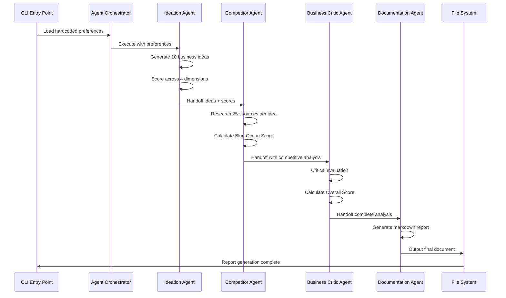

# Business Idea Generator POC - Architecture Documentation

## Document Overview

This document defines the technical architecture for the Business Idea Generator POC, a sequential multi-agent AI system that generates and evaluates business ideas. The architecture is designed for rapid iteration and experimentation, prioritizing simplicity and development speed over production-ready complexity.

## System Overview

### Purpose
The Business Idea Generator POC is a command-line application that demonstrates a sequential multi-agent pattern using the OpenAI Agents SDK for TypeScript. The system processes hardcoded business preferences through four specialized agents to produce ranked business ideas with comprehensive analysis.

### Key Characteristics
- **Architecture Pattern**: Sequential multi-agent with handoffs
- **Execution Model**: Command-line interface (CLI)
- **Agent Flow**: Linear progression through 4 specialized agents
- **Iteration Focus**: Rapid prototyping and experimentation
- **Output Format**: Structured Markdown reports

## Technology Stack

### Core Technologies
- **Runtime**: Node.js LTS (v22.x) - Latest stable version for modern JavaScript features
- **Language**: TypeScript 5.x - Type safety and modern language features
- **AI Framework**: OpenAI Agents SDK for TypeScript (latest) - Multi-agent orchestration
- **Model**: OpenAI o3 - High-capability language model for complex reasoning
- **Logging**: Winston 3.x - Structured logging for monitoring and debugging

### Package Management & CI/CD
- **Package Manager**: npm with latest stable versions
- **CI/CD Pipeline**: GitHub Actions
- **Version Strategy**: Latest stable versions for all dependencies

### Development Tools
- **TypeScript Compiler**: Latest with strict type checking
- **Node.js**: LTS version for stability and long-term support

## Architectural Patterns

### Sequential Multi-Agent Pattern
Based on OpenAI Agents SDK best practices, the system implements a sequential handoff pattern where each agent specializes in a specific domain:

1. **Ideation Agent** → Creative business idea generation
2. **Competitor Agent** → Market research and competitive analysis  
3. **Business Critic Agent** → Critical evaluation and reality checking
4. **Documentation Agent** → Report generation and synthesis

### Agent Handoff Implementation
Using the OpenAI Agents SDK [`Agent.create()`](https://github.com/openai/openai-agents-js) method for type-safe handoffs:

```typescript
const agent = Agent.create({
  name: 'Agent Name',
  instructions: 'Agent instructions',
  handoffs: [nextAgent], // Type-safe handoff configuration
});
```

## System Architecture

### High-Level Architecture
```
┌─────────────────────────────────────────────────────────────────┐
│                    CLI Application Entry Point                  │
├─────────────────────────────────────────────────────────────────┤
│  ┌─────────────────┐  ┌─────────────────┐  ┌─────────────────┐  │
│  │  Configuration  │  │    Logging      │  │  Error Handler  │  │
│  │    Manager      │  │    Service      │  │                 │  │
│  └─────────────────┘  └─────────────────┘  └─────────────────┘  │
├─────────────────────────────────────────────────────────────────┤
│                      Agent Orchestrator                        │
├─────────────────────────────────────────────────────────────────┤
│  ┌─────────────────┐  ┌─────────────────┐  ┌─────────────────┐  │
│  │   Ideation      │  │   Competitor    │  │  Business Critic│  │
│  │     Agent       │  │     Agent       │  │     Agent       │  │
│  │                 │  │                 │  │                 │  │
│  │  [No Tools]     │  │ [Web Search]    │  │ [Web Search]    │  │
│  └─────────────────┘  └─────────────────┘  └─────────────────┘  │
│           │                     │                     │         │
│           └─────────────────────┼─────────────────────┘         │
│                                 │                               │
│                    ┌─────────────────┐                         │
│                    │ Documentation   │                         │
│                    │     Agent       │                         │
│                    │                 │                         │
│                    │  [No Tools]     │                         │
│                    └─────────────────┘                         │
├─────────────────────────────────────────────────────────────────┤
│                      External Services                         │
│  ┌─────────────────┐  ┌─────────────────┐  ┌─────────────────┐  │
│  │   OpenAI API    │  │  Web Search     │  │  File System    │  │
│  │     (o3)        │  │   Service       │  │   (Output)      │  │
│  └─────────────────┘  └─────────────────┘  └─────────────────┘  │
└─────────────────────────────────────────────────────────────────┘
```

### Component Architecture

#### Core Components
1. **CLI Entry Point** - Application bootstrap and configuration
2. **Agent Orchestrator** - Sequential agent execution and handoff management
3. **Agent Modules** - Specialized agents with distinct responsibilities
4. **Service Layer** - Logging, configuration, and external API management
5. **Output Handler** - Markdown report generation and file management

#### Agent Specifications

**Ideation Agent**
- **Purpose**: Generate creative business ideas
- **Tools**: None (pure reasoning)
- **Input**: Business preferences (vertical, sub-vertical, business model)
- **Output**: 10 business ideas with initial scoring

**Competitor Agent**
- **Purpose**: Market research and competitive analysis
- **Tools**: OpenAI built-in `web_search` tool
- **Input**: Business ideas from Ideation Agent
- **Output**: Enhanced ideas with competitive analysis and Blue Ocean scores

**Business Critic Agent**
- **Purpose**: Critical evaluation and risk assessment
- **Tools**: OpenAI built-in `web_search` tool
- **Input**: Business ideas with competitive analysis
- **Output**: Final evaluation with Overall scores

**Documentation Agent**
- **Purpose**: Report synthesis and formatting
- **Tools**: None (document generation)
- **Input**: Fully analyzed business ideas
- **Output**: Structured Markdown report

## Application Structure

### Folder Structure
```
business-idea-multi-agent/
├── src/
│   ├── agents/
│   │   ├── ideation/
│   │   │   ├── ideation-agent.ts
│   │   │   └── ideation-types.ts
│   │   ├── competitor/
│   │   │   ├── competitor-agent.ts
│   │   │   └── competitor-types.ts
│   │   ├── critic/
│   │   │   ├── critic-agent.ts
│   │   │   └── critic-types.ts
│   │   └── documentation/
│   │       ├── documentation-agent.ts
│   │       └── documentation-types.ts
│   ├── services/
│   │   ├── logging/
│   │   │   └── logger.ts
│   │   ├── config/
│   │   │   └── config.ts
│   │   └── external/
│   │       └── web-search.ts
│   ├── types/
│   │   ├── business-idea.ts
│   │   └── preferences.ts
│   ├── utils/
│   │   └── helpers.ts
│   └── main.ts
├── docs/
│   ├── PRD/
│   ├── guidelines/
│   │   └── architecture.md
│   └── output/
│       └── [generated-reports]
├── package.json
├── tsconfig.json
└── README.md
```

### Module Organization

#### Agent-Based Modules
Each agent is organized as a self-contained module with:
- **Agent Implementation**: Core agent logic and instructions
- **Type Definitions**: Agent-specific TypeScript interfaces
- **Configuration**: Agent-specific settings and parameters

#### Service Layer
- **Logging Service**: Winston-based structured logging
- **Configuration Service**: Environment variable management
- **External APIs**: Web search and OpenAI API integration

#### Type System
- **Business Idea Types**: Core data structures for business ideas
- **Preference Types**: Input preference definitions
- **Agent Types**: Agent-specific interfaces and handoff contracts

## Data Flow Architecture

### Sequential Processing Flow


### Data Models

#### Business Idea Data Structure
```typescript
interface BusinessIdea {
  title: string;
  description: string;
  businessModel: string;
  disruptionPotential: number; // 0-10
  marketPotential: number; // 0-10
  technicalComplexity: number; // 0-10
  capitalIntensity: number; // 0-10
  blueOceanScore: number; // 0-10
  overallScore: number; // 0-10
  reasoning: {
    disruption: string;
    market: string;
    technical: string;
    capital: string;
    blueOcean: string;
    overall: string;
  };
  competitorAnalysis: string;
  criticalAnalysis: string;
}
```

#### Preference Configuration
```typescript
interface BusinessPreferences {
  vertical: string;
  subVertical: string;
  businessModel: string;
}
```

## Security Guidelines

### Minimal Security Approach
Given the POC nature and CLI execution environment, security measures are intentionally minimal:

#### API Key Management
- **OpenAI API Key**: Stored in environment variables (`OPENAI_API_KEY`)
- **Environment File**: `.env` file for local development (excluded from version control)
- **Production**: Environment variables set in CI/CD pipeline

#### Error Handling
- **Basic Error Handling**: Graceful failure with informative error messages
- **API Failures**: Retry logic with exponential backoff
- **Input Validation**: Basic validation of hardcoded preferences

#### Security Considerations for Future Enhancement
- Input sanitization for dynamic preferences
- Rate limiting for external API calls
- Secure credential management for production deployment
- Audit logging for security events

## Testing Strategy

### Current Approach (POC Phase)
- **No Automated Tests**: Manual testing only for rapid iteration
- **Manual Testing**: End-to-end execution validation
- **Error Scenario Testing**: Manual verification of error handling

### Manual Testing Checklist
1. **Successful Execution**: Complete agent workflow execution
2. **Error Handling**: API failures, network issues, invalid configurations
3. **Output Validation**: Markdown report generation and formatting
4. **Performance**: Execution time and resource usage monitoring

## Monitoring and Observability

### Logging Strategy
Using Winston for structured logging:

#### Log Levels
- **ERROR**: System failures, API errors, unhandled exceptions
- **WARN**: Recoverable errors, performance warnings, deprecation notices
- **INFO**: Agent transitions, major workflow events, completion status
- **DEBUG**: Detailed execution flow, API request/response details

#### Log Format
```json
{
  "timestamp": "2025-01-07T18:00:00.000Z",
  "level": "info",
  "message": "Agent handoff completed",
  "agent": "ideation",
  "nextAgent": "competitor",
  "ideasGenerated": 10,
  "executionTime": "45.2s"
}
```

### Performance Monitoring
- **Execution Time**: Per-agent timing and total workflow duration
- **API Usage**: Request counts, response times, error rates
- **Resource Usage**: Memory consumption, CPU utilization

### Error Tracking
- **Agent Failures**: Capture and log agent execution errors
- **API Failures**: Track external service failures and retry attempts
- **Data Validation**: Log data integrity issues and validation failures

## Deployment Architecture

### Development Environment
- **Local Development**: Direct Node.js execution
- **Configuration**: `.env` file with development settings
- **Output**: Local file system for generated reports

### CI/CD Pipeline (GitHub Actions)
```yaml
# Simplified pipeline structure
name: Business Idea Generator POC
on: [push, pull_request]

jobs:
  build:
    runs-on: ubuntu-latest
    steps:
      - uses: actions/checkout@v4
      - uses: actions/setup-node@v4
        with:
          node-version: '22.x'
      - run: npm ci
      - run: npm run build
      - run: npm run lint
      # Manual testing only - no automated tests
```

### Production Considerations (Future)
- **Containerization**: Docker for consistent deployment
- **Environment Management**: Separate configurations for different environments
- **Secret Management**: Secure API key storage and rotation
- **Monitoring**: Application performance and error tracking

## Extension Points

### Future Enhancement Opportunities
1. **Dynamic Preferences**: Web interface or API for preference input
2. **Database Integration**: Persistent storage for generated ideas and analysis
3. **API Interface**: RESTful API for external integrations
4. **Advanced Analytics**: Machine learning for idea scoring optimization
5. **Collaborative Features**: Multi-user idea generation and evaluation

### Scalability Considerations
- **Parallel Processing**: Concurrent idea analysis for performance
- **Queue System**: Message queues for agent workflow management
- **Microservices**: Service decomposition for independent scaling
- **Caching**: Redis for intermediate result caching

## Risk Management

### Technical Risks
- **API Dependencies**: OpenAI API availability and rate limits
- **External Service Reliability**: Web search service failures
- **Data Quality**: Inconsistent or incomplete analysis results

### Mitigation Strategies
- **Retry Logic**: Exponential backoff for API failures
- **Error Handling**: Graceful degradation and informative error messages
- **Manual Validation**: Human review of generated results during POC phase

## Conclusion

This architecture provides a solid foundation for the Business Idea Generator POC, emphasizing simplicity, rapid iteration, and clear separation of concerns. The sequential multi-agent pattern using the OpenAI Agents SDK enables sophisticated business idea analysis while maintaining development velocity.

The minimal approach to security and testing aligns with POC objectives, while the documented extension points and future enhancement strategies provide a clear path for evolution into a production-ready system.

---

*This architecture document serves as the technical blueprint for the Business Idea Generator POC implementation. It should be reviewed and updated as the system evolves through the development process.*